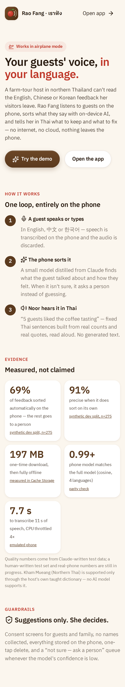
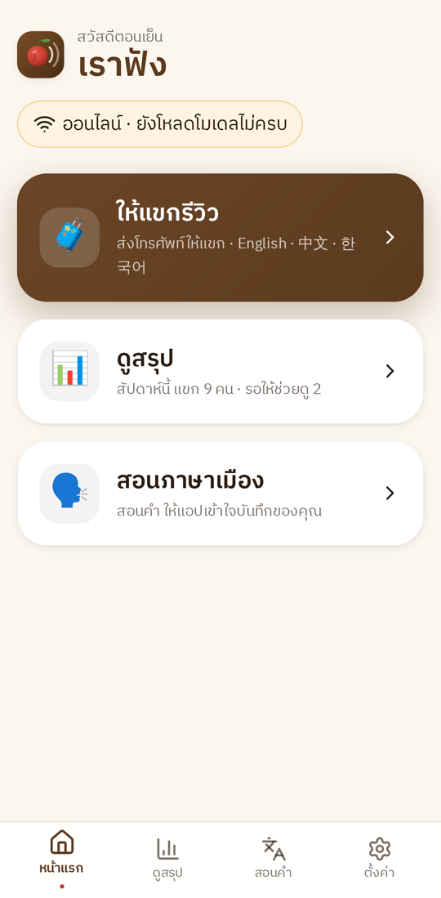
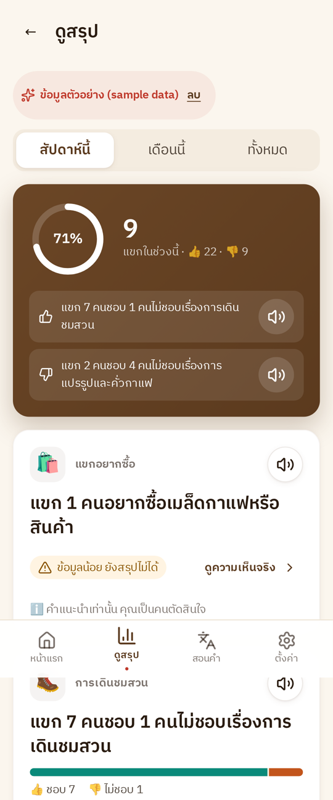
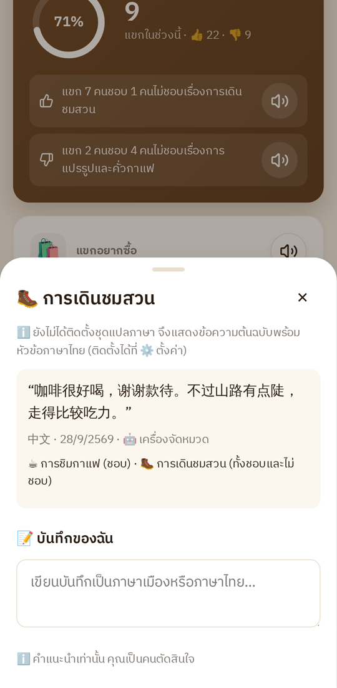
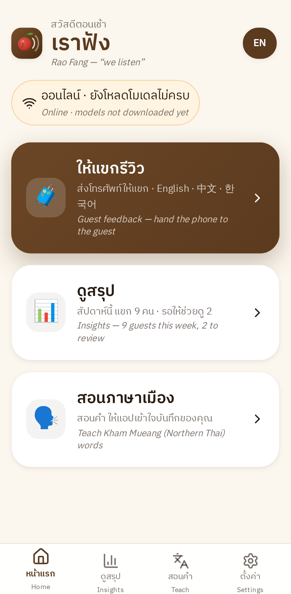
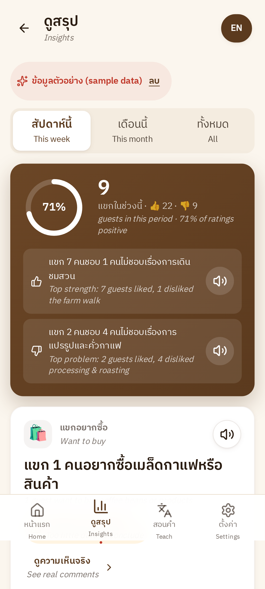
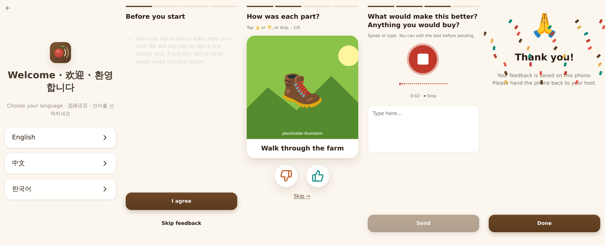

# เราฟัง Rao Fang — offline visitor feedback for a farm-tour host

Offline PWA (React + Vite + TypeScript) for Noor, a coffee farmer in northern Thailand who hosts foreign visitors.
Guests leave feedback in English, Chinese or Korean on the phone; an on-device classifier sorts it into tour aspects;
Noor reviews Thai insights built from counts, fixed templates and real quotes, with Thai audio. Kham Mueang
(Northern Thai) enters through Teach Mode and a personal dictionary that normalises Noor's notes to Central Thai.
Spec: [`spec.md`](spec.md).

## Screenshots

| Landing (browser) | Home | Insights | Evidence sheet |
|---|---|---|---|
|  |  |  |  |

**English presenter captions** (tap **EN** in the top bar; on automatically from the landing page's *Try the demo*). Captions are the exact English of each fixed Thai template, not a translation, so what an English-speaking audience reads is what Noor hears:

| Home + captions | Insights + captions |
|---|---|
|  |  |

Guest flow (language → consent → swipe ratings → voice → thanks):


Captured in headless Chrome emulating a Pixel 7. Insights shows the built-in **sample data** (real model outputs on
held-out synthetic items); tour photos are placeholder illustrations. UI: IBM Plex Sans Thai (bundled, 64 KB), Lucide
icons, View Transitions; axe-core reports 0 accessibility violations on all main screens.

## Status — what is done and what is not

| Part | Status |
|---|---|
| PWA: Guest Mode, Insights, not-sure queue + manual tags, Teach Mode (word / sentence swap / helper), notes with Kham Mueang normalisation, Settings, PIN, export, delete | ✅ built, typechecks, unit tests pass, flows smoke-tested in headless Chromium (without models) |
| COOP/COEP headers (`vercel.json`, `public/_headers`), same-origin ONNX runtime, service-worker precache | ✅ `crossOriginIsolated === true` under `vite preview` |
| DevBenchmark / DevParity pages | ✅ built; run in emulated Chrome (Pixel 7, offline, 4× CPU throttle) — see `docs/benchmarks.md`. **Not run on a real phone yet** |
| ML pipeline (`ml/`): teacher, student, export, eval, km_eval, FLORES | ✅ code done; smoke-tested end-to-end with a fake embedder on throwaway fixtures |
| `synthetic.jsonl` (1,242) + `synthetic_balanced.jsonl` (590) and trained `heads.json` | ✅ teacher `claude-opus-5-5`; student retrained with balanced data and clause-level sentiment. Synthetic dev: aspect F1 0.809, 70% auto-classified at 92% precision, sentiment 0.72 (see `docs/eval.md`) |
| Phase 0 numbers, model sizes | ❌ TODO on the phone (`docs/benchmarks.md`) |
| Human test set, Kham Mueang pairs, Thai audio clips, tour photos, evidence citations | ❌ **[MANUAL]** — templates and scripts provided |


## Run the app

```bash
cd app
npm install            # postinstall copies the ONNX runtime WASM into public/ort/
npm run dev            # http://localhost:5173 (COOP/COEP set)
npm test               # vitest: normaliser, uncertainty rules, insights engine, templates
npm run build && npm run preview
```

Routes: `#/` home · `#/guest` · `#/insights` · `#/teach` · `#/settings` · `#/dev/benchmark` · `#/dev/parity`.

## Deploy (HTTPS from day one, spec §16.1)

Import the repo on **Vercel** or **Netlify** and deploy — no settings needed. The root `vercel.json` / `netlify.toml`
build `app/`, set the COOP/COEP headers and skip the server-only ONNX package. (If you set Vercel's Root Directory to
`app` instead, `app/vercel.json` does the same.) Both paths were verified building from a clean copy of the repo.

Test the phone **only over that HTTPS URL**. ⚙️ Settings opens with a **“พร้อมใช้ออฟไลน์ไหม?”** checklist that says
what is missing and how to fix it, in Thai.

**Updates:** pushing a new `heads.json` (or any app change) redeploys; the phone picks it up the next time the app is
opened online, and feedback sorted by an older classifier is re-sorted automatically (hand-tagged items are kept).
Models only need re-downloading if the encoder or Whisper model changes.

## Offline install on the phone

1. Open the HTTPS URL in Chrome on the Android phone → menu → *Install app* / *Add to Home screen*.
2. Open from the home screen → ⚙️ → *ดาวน์โหลด / ตรวจสอบโมเดลหลัก* (whisper-tiny + e5, ~197 MB, on Wi-Fi). Optional: *ดาวน์โหลดชุดแปลภาษา* (NLLB, large).
3. Open ⚙️ Settings: the readiness checklist at the top should be all ✅ (it lists the fix for anything ❌).
4. Airplane mode on → everything (guest → insights → not-sure → teach → notes) keeps working.

## Model sizes

| Bundle | Contents | Measured size |
|---|---|---|
| Core (target ≤ 200 MB) | app shell + ONNX runtime + whisper-tiny q8 + e5-small q8 + heads.json + Thai clips | **197.3 MB** in emulated Chrome (clips not yet recorded); confirm on phone |
| Translation pack (optional) | NLLB-200-distilled-600M q8 | **TODO — measure on phone** |
| App shell precache (measured at build) | JS/CSS/HTML + ONNX runtime WASM (26.9 MB) + icons | 27,118 KiB |

Sizes are read from Cache Storage in Settings and DevBenchmark. See `docs/benchmarks.md`.

## Reproduce the ML pipeline (CPU only)

```bash
cd ml
pip install -r requirements.txt
export ANTHROPIC_API_KEY=...
python gen_synthetic.py --model <claude-model-id> --workers 4   # → data/synthetic.jsonl (cached, resumable)
python gen_synthetic.py --model <claude-model-id> --balanced     # → data/synthetic_balanced.jsonl (assigned aspect/sentiment targets)
python train_student.py --sentiment-mode polarity                # → data/student.json, dev report, app/public/models/parity.json
python export_heads.py                                          # → app/public/models/heads.json
# [MANUAL] write data/human_test.jsonl (see data/README.md), then:
python eval.py                                                  # → docs/eval.md
# [MANUAL] export Teach Mode data from the app, then:
python km_eval.py --from-export raofang-export-YYYY-MM-DD.json  # → docs/km_eval.md
python flores_eval.py                                           # optional → docs/flores_eval.md
```

Then open `#/dev/parity` on the phone: cosine between Python and browser embeddings must be > 0.99.

## Starter Kham Mueang words

Teach › *ตรวจคำเมืองตัวอย่าง* shows 38 words from a public list ([sanook.com](https://www.sanook.com/campus/1392241/)). Noor taps ✓ to keep each word, ✏️ to correct it or skip it. Only words she keeps go into her dictionary, because spellings and meanings vary by village. Words that are also common Central Thai words with another meaning (ท่า, หัน, จ้อง, เมิน…) are left out so her notes don't get garbled.

## Thai audio clips (spec §16.3)

`python scripts/gen_audio_script.py` writes `scripts/audio_script.md` (55 clips). A Thai speaker records them into
`app/public/audio/th/`, then `python scripts/gen_audio_script.py --scan` writes the manifest. Missing clips → the whole
sentence is spoken with `speechSynthesis`; no Thai voice → the app shows how to install one.

## Docs

`docs/benchmarks.md` · `docs/eval.md` · `docs/km_eval.md` · `docs/datasets.md` · `docs/responsible_ai.md` · `docs/video_script.md`
